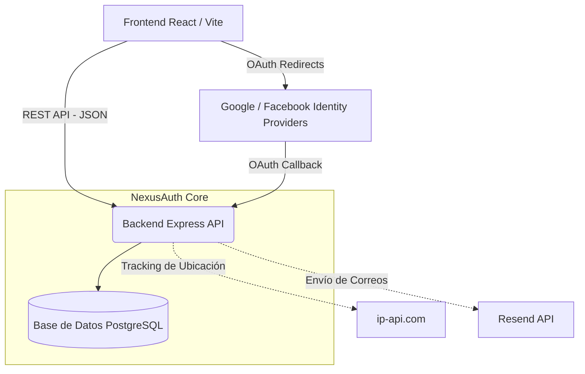

# NexusAuth

NexusAuth es un microservicio de Identidad Centralizada "Zero-Cost" construido con Node.js, Express, y Prisma.

## Características Principales (Feature Inicial)
* **Fecha de Implementación:** 2026-03-09
* **Login Local:** Autenticación con Email/Password, encripción con Bcrypt y JWT.
* **Integración Social (OAuth2):** Soporte para Google y Facebook. 
* **MFA (Zero-Cost TOTP):** App Authenticator (Google Authenticator / Authy) con códigos de recuperación. Secretos de validación cifrados AES-256.
* **Account Recovery:** Links de reseteo de password enlazados a correos en Resend con expiración a los 15 minutos.
* **Monitoreo de Auditoría:** Histórico interactivo de inicios de sesión (exitosos y fallidos) incluyendo geolocalización de IPs visualizada a través de mapas (Leaflet).

## Arquitectura de Componentes



## Requisitos Previos
* Node.js v18+
* PostgreSQL local o en la nube (la variable `DATABASE_URL` debe estar configurada en el `.env`).
* Credenciales de `RESEND_API_KEY`, `GOOGLE_CLIENT_ID` (y secret), y `FACEBOOK_APP_ID` (y secret) obtenidas desde los portales respectivos.

## Instrucciones de Instalación
1. Clonar el repositorio.
2. Copiar `.env.example` a `.env` y sustituir las variables (`DATABASE_URL`, credenciales sociales y de email).
3. Instalar librerías e inicializar base de datos:
   ```bash
   npm install
   npx prisma generate
   npx prisma migrate dev
   ```
4. Ejecutar el servidor para Desarrollo:
   ```bash
   npm run dev
   ```
   *El servidor deberá ejecutarse por defecto en http://localhost:3000.*

5. Para usar en producción compilar TypeScript:
   ```bash
   npm run build
   npm run start
   ```
