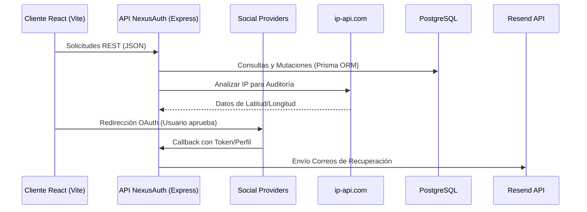
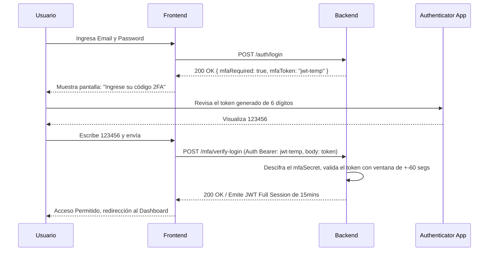

# Documentación Técnica: NexusAuth (v1.0.0)

**Fecha:** 2026-03-09

## Arquitectura del Microservicio Centralizado (Zero-Cost Identity Provider)
* **Poder de Cómputo / API:** Construido sobre Node.js y Express (TypeScript).
* **Almacenamiento y Migraciones:** PostgreSQL administrado por Prisma ORM.
* **Componentes Externos (OAuth):** `passport-google-oauth20` y `passport-facebook` conectándose a las IDP respectivas con callback urls estandarizadas en desarrollo local.
* **MFA (Zero-Cost TOTP):** Utiliza `otplib` para generar *Time-Based One-Time Passwords* apegados a algoritmos y protocolos IETF HOTP (RFC 4226/6238). Los Secretos MFA (`mfa_secret`) jamás se almacenan localmente en texto claro, sino encriptados (AES-256-GCM) usando Node `crypto` y un Vector de Inicialización dinámico.
* **Notificaciones Outbound (Email):** Implementado vía servicio de entrega `resend` que expone planes sin costo.

## Componentes y Comunicación del Sistema



## Flujo de Autenticación MFA (Doble Factor)



## Endpoints Principales Disponibles

### Authentication (Local + MFA Lifecycle)
* **`POST /auth/register`**: Recibe `{ email, password }`. Otorga password hashing y validaciones de complejidad. Si el correo existe arroja error 400.
* **`POST /auth/login`**: Crea el payload JWT (Session Lifecycle 15 mins). Compara hashes `bcrypt`. Retorna objeto `{ mfaRequired: true, mfaToken: ... }` si el usuario habilitó Two-Factor o un Session-JWT completo.
* **`POST /mfa/setup`**: Validado mediante Bearer Token. Retorna secret key en crudo + base64 data url enlazando un URI `otpauth://` lista para escanear en apps como Google Authenticator.
* **`POST /mfa/verify-setup`**: Habilita oficialmente la capa de seguridad adicional y retorna un array pregenerado de 10 llaves de seguridad Offline (Backup Codes) alocados en PostgreSQL.
* **`POST /mfa/verify-login`**: Requiere payload "auth pending" en headers JWT Auth. Acepta `{ token: XXXXXX }` el cual es verificado considerando el "±30 second drift rule". Da tokens totales.
* **`GET /auth/history`**: Requiere Bearer Token. Retorna los últimos 5 intentos de inicio de sesión (Exitosos y Fallidos) incluyendo metadata de red y ubicación.

### Social Providers (OAuth2 Auth Code Flow)
* **`GET /auth/google`**: Init OAuth window.
* **`GET /auth/facebook`**: Init OAuth window.
* **Callbacks asociados:** `/auth/google/callback` y `/facebook/callback` respectivamente. Valida o crea un IDP en esquema Prisma `OAuthProvider`. Termina con `oauthCallback` arrojando un JWT válido.

### Recovery
* **`POST /recovery/forgot-password`**: Se consume con un `{ email }`. Dispara `resend.emails.send()`.
* **`POST /recovery/reset-password`**: Cambia el secret password de un usuario sin sesión consumiendo el Short-Lived JWT proveido durante la recuperación por email.

## Diseño de Base de Datos
Las tablas en el esquema de PostgreSQL administrado con Prisma incluyen las siguientes entidades clave:

1. **`User` (Usuarios):** Almacena el identificador universal, correo (único), _hash_ del password (si aplica configuración local), secretos para MFA encriptados y banderas de configuración como `mfaEnabled` o cuentas verificadas.
2. **`OAuthProvider` (Integraciones Sociales):**  Provee Relación de 1 a muchós (1 usuario a muchas plataformas). Se asocia al `User` a través del `userId`, almacenando de dónde provino la cuenta externa (ej. GOOGLE, FACEBOOK) y el ID externo para login social continuo sin colisiones.
3. **`BackupCode` (Códigos de Recuperación MFA):** Una lista ligada al `User`. Códigos generados en texto plano durante la configuración del MFA para recuperar cuentas en caso de pérdida de un smartphone. Son _consumibles_, una vez utilizados se borran atómicamente del registro base.
4. **`LoginLog` (Bitácora de Eventos):** Registra cada intento de autenticación individual, asistiéndose mediante validaciones tanto correctas como incorrectas (`SUCCESS` / `FAILED`). Contiene fecha exacta, dirección IP y metadatos complementarios como Agente de Usuario y geolocalización extraída (`latitude`, `longitude`, `location`).

## Observabilidad y Seguimiento (Audit Logs)
- **Bitácora de Accesos (`LoginLog`)**: El sistema registra cada intento de inicio de sesión (Local, OAuth y MFA).
  - **Estado**: Clasifica intentos como `SUCCESS` o `FAILED` (contraseña incorrecta, token MFA inválido).
  - **Geolocalización**: Mediante la IP del cliente y la integración con `ip-api.com` (con soporte para resolver localhost al IP del servidor como fallback de dev), se extrae la ciudad, país y coordenadas geográficas.
  - **Visualización Interactiva**: Se dispone de una pantalla exclusiva (`/login-history`) en el frontend que integra tarjetas individuales y mapas en miniatura (`react-leaflet`). Se incluyó un modal para ampliar dicho mapa por evento, para que el usuario identifique fácil e interactivamente accesos no autorizados.
- **Logging de Servidor**: Usando `winston`, logs asíncronos en consola estandarizados marcan timestamps en eventos críticos tales como `AUTH_INVALID_TOTP` ó `USER_MFA_ACTIVATED`. 

## Guía de Migración de Base de Datos (Nuevo Entorno)

Al trasladar el entorno de desarrollo local o llevar a producción la API de NexusAuth en un servidor Linux/Windows donde exista una instalación nativa de PostgreSQL operando en una URL diferente, debes seguir los siguientes pasos:

1. **Clonar e initializar ambiente básico**:
   - Transfiere tu código (via `git clone` o equivalente).
   - Crea y modifica el archivo `.env` configurando tu `DATABASE_URL` exclusiva a este ambiente (Asegúrate de cambiar usuario, password y nombre base: e.g., `postgresql://<usuario>:<contrasena>@localhost:5432/nuevaDB_NexusAuth?schema=public`).
2. **Instalar Dependencias de Node:**
   - En el backend y raiz, ejecuta `npm install`.
3. **Generar Cliente Relacional de Prisma:**
   - Prisma debe alocarse basado en el entorno nativo binario de tu SO. Ejecuta en terminal:
   ```bash
   npx prisma generate
   ```
4. **Desplegar la estructura o esquemas al Servidor SQL (Pushing):**
   - **Opción A (Recomendada DevOps):** Levanta las migraciones nativas para replicar la estructura exacta existente:
     ```bash
     npx prisma migrate deploy
     ```
   - **Opción B (Ambientes rápidos e inestables que continúan desarrollándose):** Empuja tu esquema actual directo al DB omitiendo logs de migración.
     ```bash
     npx prisma db push
     ```
5. **Configuración Final**: Ejecuta tu app normalmente con `npm run dev` o compila tu pipeline de producción `npm run build && npm start`. El backend NexusAuth generará las tablas requeridas que no existan si usaste el método correcto y aceptará conexiones enseguida.
