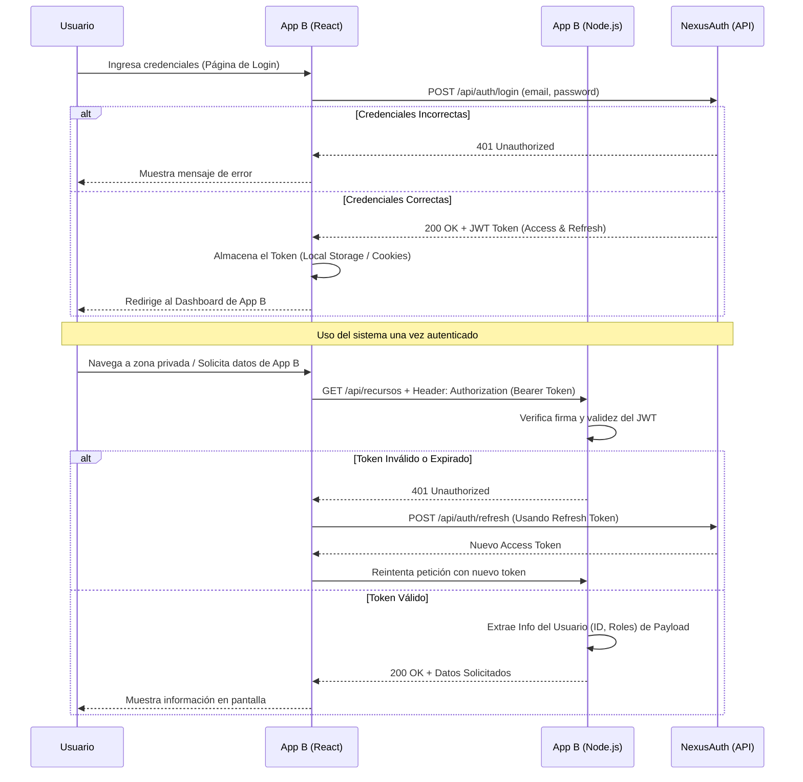
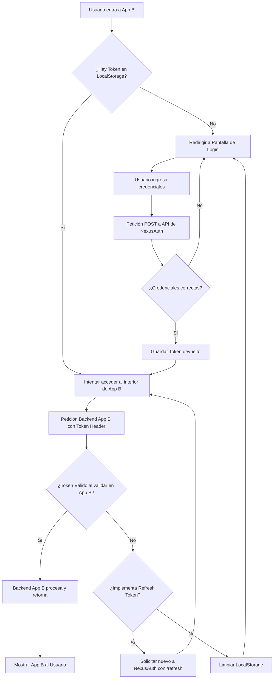

# Guía de Integración: NexusAuth como Identity Provider Centralizado

El objetivo de esta guía es explicar cómo otro sistema (al que llamaremos **App B**, compuesto por un frontend en React y un backend en Node.js) puede delegar la responsabilidad de autenticación, verificación de credenciales y emisión de tokens (JWT) a **NexusAuth**.

App B no almacenará contraseñas ni validará logins en su propia base de datos; simplemente consumirá la API de NexusAuth para autenticar al usuario y luego validará localmente los tokens que reciba.

---

## 1. Arquitectura de Comunicación (Diagrama de Secuencia)

El flujo de cómo se comunican las 3 partes principales (Frontend App B, Backend App B y NexusAuth API) es el siguiente:



---

## 2. Implementación Paso a Paso en el Sistema Destino (App B)

Dado que App B está desarrollada con React y Node.js, sigue estas instrucciones divididas en Frontend y Backend.

### Paso 1: Configuración Global (Compartir el Secreto JWT)

Tanto **NexusAuth** como el Backend de **App B** necesitan conocer la misma clave secreta (`JWT_SECRET`) para que App B pueda validar que el token que envía el usuario fue genuinamente emitido por NexusAuth.

1. Abre el archivo `.env` de **App B** (Backend).
2. Agrega la variable con el mismo valor que utilizas en NexusAuth:

```env
# Archivo .env del Backend de App B
NEXUSAUTH_JWT_SECRET="<aqui_va_el_mismo_secreto_que_tiene_nexusauth>"
```

3. Además, si NexusAuth tiene políticas estrictas de CORS, asegúrate de que el backend de NexusAuth tenga en su lista de orígenes permitidos (CORS whitelist) la URL del frontend de App B (ej: `http://localhost:3000` o su dominio en producción).

---

### Paso 2: Implementación en el Frontend (React - App B)

Tu frontend actuará como el "puente", enviando las credenciales directamente a NexusAuth y almacenando el token resultante.

#### A. Centralizar el Servicio de Autenticación
Crea un archivo de servicio que se comunique con la API de NexusAuth.

```javascript
// src/services/authService.js
const NEXUSAUTH_API_URL = 'http://localhost:8000/api/auth'; // URL de NexusAuth

export const loginUser = async (email, password) => {
  try {
    const response = await fetch(`${NEXUSAUTH_API_URL}/login`, {
      method: 'POST',
      headers: { 'Content-Type': 'application/json' },
      body: JSON.stringify({ email, password })
    });

    const data = await response.json();
    
    // Si falla el login, lanzamos un error
    if (!response.ok) {
        throw new Error(data.message || 'Error en autenticación');
    }
    
    // Si es exitoso, almacenamos el token de acceso localmente
    // Se recomienda usar cookies HttpOnly para mayor seguridad en producción
    localStorage.setItem('accessToken', data.accessToken);
    if(data.refreshToken) {
        localStorage.setItem('refreshToken', data.refreshToken);
    }
    
    return data.user;
  } catch (error) {
    console.error('Error de Login:', error);
    throw error;
  }
};
```

#### B. Inyectar Token en Peticiones al Propio Backend
Cuando el frontend de App B quiera consumir recursos privados de su propio backend, debe adjuntar el token.

```javascript
// src/services/apiService.js (Ejemplo de consumo a App B)
export const fetchPrivateData = async () => {
    const token = localStorage.getItem('accessToken');
    
    const response = await fetch('http://localhost:4000/api/datos-privados', { // URL del Backend de App B
        method: 'GET',
        headers: {
            'Authorization': `Bearer ${token}`,
            'Content-Type': 'application/json'
        }
    });

    return response.json();
}
```

---

### Paso 3: Implementación en el Backend (Node.js - App B)

El backend de App B **NO** verifica credenciales contra la base de datos de usuarios. Solamente confía en la firma criptográfica del JWT emitido por NexusAuth.

#### A. Crear el Middleware de Verificación
Debes interceptar las peticiones a rutas protegidas, leer el token del header `Authorization` y verificarlo. Instala la librería `jsonwebtoken` si no la tienes (`npm install jsonwebtoken`).

```javascript
// src/middlewares/authMiddleware.js
const jwt = require('jsonwebtoken');

// IMPORTANTE: Este secreto debe ser el mismo que usa NexusAuth
const NEXUSAUTH_JWT_SECRET = process.env.NEXUSAUTH_JWT_SECRET;

const verifyNexusAuthToken = (req, res, next) => {
  // 1. Extraer el token del header "Authorization: Bearer <token>"
  const authHeader = req.headers['authorization'];
  const token = authHeader && authHeader.split(' ')[1];

  if (!token) {
    return res.status(401).json({ message: 'Acceso denegado. Se requiere Token de autenticación.' });
  }

  try {
    // 2. Verificar que el token fue firmado por NexusAuth y no ha expirado
    const decoded = jwt.verify(token, NEXUSAUTH_JWT_SECRET);
    
    // 3. Inyectar la información del usuario en la request (ID, roles, etc.)
    req.user = decoded; 
    
    // 4. Continuar al controlador de la ruta
    next();
  } catch (error) {
    // Si el token expiró o la firma es inválida
    return res.status(403).json({ message: 'Token inválido o expirado. Debe iniciar sesión nuevamente.' });
  }
};

module.exports = verifyNexusAuthToken;
```

#### B. Proteger las Rutas de la API de App B
Utiliza el middleware en cualquier ruta que deba ser privada.

```javascript
// src/routes/privadas.js
const express = require('express');
const router = express.Router();
const verifyNexusAuthToken = require('../middlewares/authMiddleware');

// Protegemos la ruta inyectando el middleware
router.get('/mis-datos', verifyNexusAuthToken, (req, res) => {
  // Aquí sabemos que el usuario está validado por NexusAuth
  // req.user contiene el payload descifrado del JWT
  
  const userId = req.user.id;
  const userRole = req.user.role;

  res.json({
    message: 'Datos obtenidos exitosamente de App B',
    data: { 
        id: userId, 
        rol: userRole, 
        info: 'Esta información es servida por App B, autenticada por NexusAuth' 
    }
  });
});

module.exports = router;
```

---

## 3. Diagrama Lógico de Decisión y Estado (Frontend App B)

Este diagrama modela el comportamiento del frontend para manejar la persistencia de la sesión:



## Resumen de Integración

1. **Variables de entorno:** Compartir el secreto JWT entre los dos backends.
2. **CORS:** Habilitar a **App B Frontend** para consumir la API de **NexusAuth Backend**.
3. **Frontend:** El login lo gestiona el frontend de **App B** conectándose directamente al endpoint `/login` de **NexusAuth**.
4. **Backend:** El backend de **App B** no valida password; solo descifra el token con el middleware para identificar quién realiza la petición.
